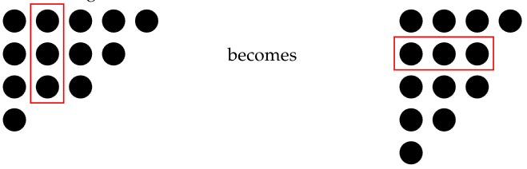

# Pathfinding Partitions
A Ferrers board is a way of representing a partition, (a1, a2, . . . , ak) as a set of rows of
dots, where the ith row has ai dots. For example, the partition (5, 4, 3, 1) is represented
by the following Ferrers board:

We could choose one of the columns of the Ferrers board, remove it, and replace it with
a row of the same length as shown below.

Call such a rearrangement a move. The purpose of this étude is to find a sequence of
moves that will transform one partition into another, whenever this is possible.
## Task
Write a program that takes input from stdin a data file formatted according to the rules
of the Parsing Partitions étude where each scenario in the file will consist of exactly two
partitions of the same integer.
The output (to stdout) should be in standard form and represent the solution to each
scenario, i.e., a shortest sequence of moves that transforms the first partition to the
second. Each scenario in the output should be in standard form and should start with
a comment line of the form:
```# Moves required: <number of moves>```
(with a suitable replacement for ```<number of moves>```). This should be followed by
a sequence of lines, starting with the first partition, and ending with the last, so that
each line is obtained from the previous one by a move, and the number of moves used
is minimal. In the event that no such sequence of moves exists, the output should start
with:
```# No solution possible```
followed just by the two given partitions.

## Standards
For an achieved standard, the program must work correctly on valid input representing
partitions of size 25 or less.
Merit criteria include the ability to handle much larger partitions efficiently, handling
poorly-formatted input gracefully, and clearly written code.
Excellence criteria include some significant extension to the functionality of the pro-
gram, or an investigation of general properties of the problem.